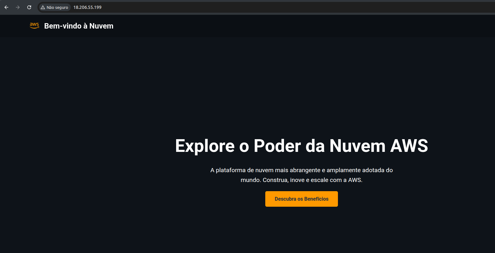

# Desvendando a Infraestrutura como Código: Terraform e AWS

Este projeto visa capacitá-lo a criar e gerenciar sua infraestrutura na nuvem AWS de forma automatizada, utilizando o poder do Terraform. Prepare-se para uma jornada prática na Infraestrutura como Código!

Para sua conveniência, este guia está disponível em [formato PDF](docs/README.pdf) e [formato HTML](docs/README.html), ideal para consulta offline.

## Sumário

-   [Prepare o Terreno](#prepare-o-terreno)
-   [Hands On](#hands-on)
-   [Finalizando e Limpando](#finalizando-e-limpando)
-   [Quer Ir Além?](#quer-ir-além)

## Prepare o Terreno

Antes de começar, garanta que você tenha o seguinte configurado:

1.  **Terraform:** Instale o Terraform. [Baixe aqui](https://developer.hashicorp.com/terraform/downloads?product_intent=terraform).
    * *Se usa Windows:* Consulte este [guia específico](docs/Como%20Instalar%20o%20Terraform%20no%20Windows.pdf).
2.  **AWS CLI:** Instale o AWS CLI. [Siga este link](https://docs.aws.amazon.com/cli/latest/userguide/getting-started-install.html).
3.  **Credenciais AWS:** Crie um usuário na AWS com chaves de acesso e configure-as localmente. O [passo a passo](docs/Criação%20de%20usuário%20na%20AWS%20e%20chave%20de%20acesso%20para%20vincular%20ao%20AWS%20CLI%20na%20sua%20maquina.pdf) está aqui.
    * Após criar, execute `aws configure` no seu terminal.

## Hands On

Vamos provisionar sua infraestrutura! 🥳

1.  **Obtenha o Código:**
    Clone o repositório ou baixe o ZIP.

    > [!TIP]
    > Prefere GitHub? Use `https://github.com/seu-repositório.git`.

    ```bash
    git clone https://github.com/skvanderson/Desafio-Terraform
    cd iac-com-terraform-e-aws
    ```

    > [!NOTE]
    > Sem Git? [Baixe o ZIP](https://github.com/skvanderson/Desafio-Terraform/-/archive/main/Desafio-Terraform.zip) e descompacte.

2.  **Abra no VS Code:**
    Navegue até a pasta do projeto e abra-o:

    ```bash
    code .
    ```

3.  **Crie e Preencha o arquivo `provider.tf`:**
    Crie o arquivo `provider.tf` e insira o seguinte conteúdo. Ele define o provedor de nuvem (AWS) e a região de implantação.

    ```hcl
    terraform {
        required_providers {
            aws = {
                source  = "hashicorp/aws"
                version = "~> 5.0"
            }
        }
    }

    provider "aws" {
        region = "us-east-1"
    }
    ```

4.  **Crie e Preencha o arquivo `key_pair.tf`:**
    Crie o arquivo `key_pair.tf` e adicione este código. Ele cria um par de chaves SSH, gerando uma chave privada localmente para acesso seguro à sua instância.

    ```hcl
    # Gera uma chave privada RSA de 4096 bits
    resource "tls_private_key" "rsa_key" {
        algorithm = "RSA"
        rsa_bits  = 4096
    }

    # Cria o Key Pair na AWS usando a chave pública gerada
    resource "aws_key_pair" "ec2_key_pair" {
        key_name   = "ec2-instance-key" # Nome do key pair na AWS
        public_key = tls_private_key.rsa_key.public_key_openssh
    }

    # Salva a chave privada em um arquivo local
    resource "local_file" "private_key_pem" {
        content  = tls_private_key.rsa_key.private_key_pem
        filename = "${path.module}/ec2-instance-key.pem"

        # Define as permissões do arquivo para que apenas o proprietário possa ler e escrever
        file_permission = "0600"
    }
    ```

5.  **Crie e Preencha o arquivo `security_group.tf`:**
    Crie o arquivo `security_group.tf` com o conteúdo abaixo. Ele configura os grupos de segurança (firewall) para controlar o tráfego de rede para sua instância EC2.

    ```hcl
    # 1. Security Group para liberar a porta 80 (HTTP) para qualquer origem
    resource "aws_security_group" "http_sg" {
        name        = "allow-http-sg"
        description = "Allow HTTP inbound traffic"

        ingress {
            from_port   = 80
            to_port     = 80
            protocol    = "tcp"
            cidr_blocks = ["0.0.0.0/0"]
        }

        tags = {
            Name = "allow-http"
        }
    }

    # 2. Security Group para liberar a porta 22 (SSH) para um IP específico
    resource "aws_security_group" "ssh_sg" {
        name        = "allow-ssh-sg"
        description = "Allow SSH inbound traffic from a specific IP"

        ingress {
            from_port   = 22
            to_port     = 22
            protocol    = "tcp"
            cidr_blocks = [var.meu_ip_publico]
        }

        tags = {
            Name = "allow-ssh"
        }
    }

    # 3. Security Group para liberar todo o tráfego de saída (Egress)
    resource "aws_security_group" "egress_all_sg" {
        name        = "allow-all-egress-sg"
        description = "Allow all outbound traffic"

        egress {
            from_port   = 0
            to_port     = 0
            protocol    = "-1" # "-1" representa todos os protocolos
            cidr_blocks = ["0.0.0.0/0"]
        }

        tags = {
            Name = "allow-all-egress"
        }
    }
    ```

6.  **Crie e Preencha o arquivo `data.tf`:**
    Crie o arquivo `data.tf` e insira este conteúdo. Ele define uma fonte de dados para buscar a AMI (Amazon Machine Image) mais recente do Amazon Linux 2.

    ```hcl
    data "aws_ami" "amazon_linux" {
        most_recent = true
        owners      = ["amazon"]

        filter {
            name   = "name"
            values = ["amzn2-ami-hvm-*-x86_64-gp2"]
        }
    }
    ```

7.  **Crie e Preencha o arquivo `ec2.tf`:**
    Crie o arquivo `ec2.tf` com o código abaixo. Ele configura e provisiona a instância EC2 que servirá como seu servidor web.

    ```hcl
    # Cria a instância EC2
    resource "aws_instance" "web_server" {
        ami           = data.aws_ami.amazon_linux.id
        instance_type = "t2.micro"
        user_data     = base64encode(file("user_data.sh"))

        # Define o key pair para a instância
        key_name      = aws_key_pair.ec2_key_pair.key_name

        # Associa os 3 Security Groups à instância
        vpc_security_group_ids = [
            aws_security_group.http_sg.id,
            aws_security_group.ssh_sg.id,
            aws_security_group.egress_all_sg.id
        ]

        tags = {
            Name = "WebServer-DVP"
        }
    }
    ```

8.  **Crie e Preencha o arquivo `outputs.tf`:**
    Crie o arquivo `outputs.tf` e adicione este conteúdo. Ele especifica quais informações (como o IP público da instância e a URL do site) serão exibidas após a aplicação bem-sucedida do Terraform.

    ```hcl
    # Bloco para exibir o IP público da instância após a criação
    output "instance_public_ip" {
      description = "IP público da instância EC2"
      value       = aws_instance.web_server.public_ip
    }

    output "website_url" {
        description = "URL do site provisionado."
        value       = "http://${aws_instance.web_server.public_ip}"
    }
    ```

9.  **Crie e Preencha o arquivo `variables.tf`:**
    Crie o arquivo `variables.tf` com o código abaixo. Ele declara variáveis que podem ser facilmente configuradas, como o seu IP público, usado para restringir o acesso SSH.

    ```hcl
    variable "meu_ip_publico" {
        type        = string
        description = "Endereço IP público para o Security Group SSH"
        # IMPORTANTE: Substitua pelo seu endereço IP público
        # Para saber o seu IP público, acesse [https://www.whatismyip.com/] ou (https://meuip.com.br/) lembrando é IP do seu Provedor não do seu Roteador
        default     = "203.0.113.25/32" (matenha o /32)
    }
    ```

    > **Atenção:** No arquivo `variables.tf`, lembre-se de substituir o IP `default` pelo *seu IP público atual*. Para descobri-lo, você pode visitar [https://www.whatismyip.com/](https://www.whatismyip.com/), [https://meuip.com.br//](https://meuip.com.br/).

10. **Execute o Terraform:**
    No terminal, dentro do diretório do projeto, rode os comandos em sequência:

    ```bash
    terraform init
    terraform plan
    terraform apply
    ```
    * Confirme a execução digitando `yes` quando `terraform apply` perguntar.

11. **Verifique sua Infraestrutura:**
    Após o `apply` ser concluído com sucesso, o Terraform exibirá o IP público da sua nova instância EC2 e a URL completa do seu site.

    > [!WARNING]
    > Navegadores modernos podem tentar redirecionar para HTTPS. Como este site não está configurado para HTTPS, **você deve digitar `http://`** antes do IP na barra de endereços do seu navegador para acessá-lo corretamente.

    Seu site deve aparecer assim:

    

## Finalizando e Limpando

1.  **Destrua a Infraestrutura:**
    Quando não precisar mais, remova todos os recursos criados com:

    ```bash
    terraform destroy
    ```
    * Confirme com `yes` quando solicitado.

    > [!NOTE]
    > **Sempre** destrua sua infraestrutura ao finalizar para evitar custos inesperados.

## Quer Ir Além?

Explore a documentação para aprofundar seus conhecimentos:

* [Documentação Terraform](https://developer.hashicorp.com/terraform)
* [Provider AWS no Terraform](https://registry.terraform.io/providers/hashicorp/aws/latest/docs)
* [Lista de Providers Terraform](https://registry.terraform.io/browse/providers)
* [Documentação AWS (Português)](https://docs.aws.amazon.com/pt_br/)
